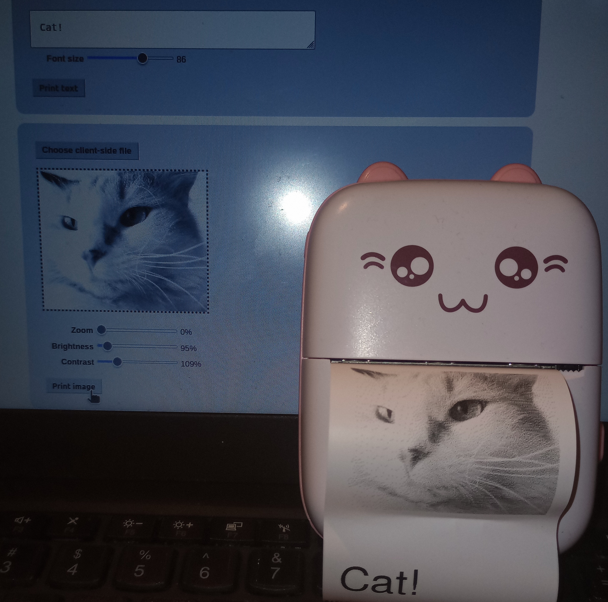

# What

This prints images and text to a cat-shaped printer - tested towards the printer I have, which reports as an MX06.
- has a text field (will render that text)
- has an image field - plus zoom, brightness and contast

# How (install)

Requirements:
- python3
  - `pillow` library (for image processing)
  - `bleak` library (for bluetooth)
  - `flask` (could be stripped out)
- bluetooth hardware (probably a laptop, though this was actually developed on a windows desktop with a USB dongle)

If you don't like virtualenvs - ubuntu tries to push you to package installs rather than pip installs, so `apt install python3-pillow python3-bleak python3-flask`

In windows, `pip install -r requirements.txt` (which is what `install-pip.bat` contains) should work.

# How (run)

Run `python catprinter.py`, it should run the little server and start a browser for you to poke at
(in windows, you can avoid running a cmd by using the `run.bat` file)

# What, more technically

A little more technically, it is:
- a HTTP server that actually does the bluetooth communication
- that serves a web page to contact itself for you to poke at 

As-is it's meant to be viewed from the same host,
but it was written in a way that makes it easy enough 
to make this a network service so that you can e.g. have a printer be a physical notification thing.

This code started off from [this gist](https://gist.github.com/mpomery/6514e521d3d03abce697409609978ede) 
and an interface that loosely imitates [this project's interface](https://github.com/NaitLee/Cat-Printer) but with simpler code (that is also somewhat slower).

# Notes (use)

As long as that server is running, the bluetooth connection stays established.

This is in part because one of its uses would be to leave it on a charger and make it the already-mentioned physical notification thing,
[like the author of that gist did](https://dev.to/mitchpommers/my-textable-cat-printer-18ge).

